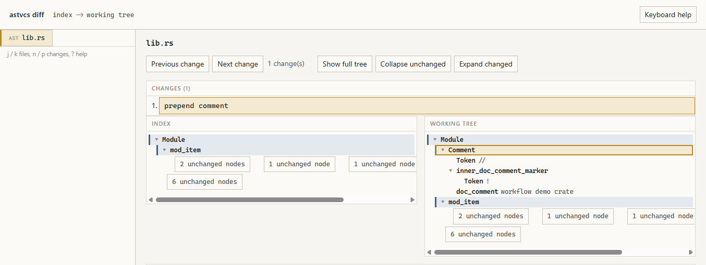

# astvcs

Structural version control for a working tree of source files.

Where tree-sitter can parse a file, astvcs stores an abstract syntax tree and diffs and merges **structural** edits. Other paths are stored as UTF-8 text with a line-oriented diff, or as binary bytes when the content is not valid UTF-8.

## What this is

astvcs is a **local-first** CLI: you work in a normal directory, and the tool tracks changes under `.astvcs/` using content-addressed states, a timeline, branches, and remotes. Command names follow the usual vocabulary (`init`, `status`, `commit`, `branch`, `merge`, `fetch`, and so on).

The goal is version control that understands code structure where parsing succeeds, so innocuous edits (a new doc comment, a moved function) do not always show up as a line cascade.

## What this is not

- **Not a drop-in Git replacement.** The standalone CLI uses its own `.astvcs/` store, not a `.git` object database, and has no git wire protocol or bidirectional sync with git remotes.
- **No conflict markers in the standalone CLI.** Overlapping edits are reported; you resolve with `merge --resolve path:ours|theirs` or fix the tree before continuing.
- **Not a hosted service.** Network sync is something you run yourself (`serve`, file paths, HTTP, HTTPS, or SSH).

Optional **Git merge and diff drivers** (`astvcs-merge-driver`, `astvcs-diff-driver`) reuse the same structural engine inside an existing Git repo with no migration. See [docs/git-integration.md](docs/git-integration.md). `import-git` is a one-way aid: it snapshots git HEAD into a single astvcs commit when migrating a tree. See the `import-git` row in [commands.md](docs/commands.md).

## How structure changes the diff

A line diff often rewrites every line below an insertion. Where tree-sitter parses a file, astvcs aligns nodes between versions and classifies edits. Prepending a doc comment to `lib.rs` can produce one intent instead of a cascade:

```
--- lib.rs
+++ lib.rs
intents:
  [0] prepend comment
```

Three-way merge applies both sides when alignment finds disjoint structural edits. Overlapping edits on the same node (for example, two renames of one identifier) are structural conflicts; the repository stays unchanged until you pass `merge --resolve path:ours|theirs` for each conflicted path.

Default diffs use compact intent labels and keep internal node IDs hidden. Pass `--details` for raw mutations and complete structural diagnostics, or `-v` for the same details plus operational notices.

To inspect how nodes were paired, run `astvcs diff --view` (optionally with a path, `--staged`, `--state`, or three-way flags). It opens a local HTML page on the change summary, with next and previous change navigation and lazy unchanged branches. The page uses the real alignment export, not a mock overlay:



## Documentation

| Document | Use it for |
|----------|------------|
| [docs/commands.md](docs/commands.md) | Full CLI reference (every subcommand and flag) |
| [docs/architecture.md](docs/architecture.md) | Repository model, diff/merge internals, locking, network, gc/fsck |
| [docs/git-integration.md](docs/git-integration.md) | Optional Git merge/diff drivers (no `.astvcs/` required) |
| [examples/README.md](examples/README.md) | Nine runnable fixture walkthroughs |
| [docs/RELEASE.md](docs/RELEASE.md) | Tagged release packaging |

Contributor Agent Skills live under [`.cursor/skills/`](.cursor/skills/) (`astvcs-develop`, `astvcs-output-ux`, `astvcs-structural-diff-merge`, `astvcs-add-tree-sitter-language`, `astvcs-integration-tests`).

## Quick start

Requires a built binary or a [release download](#install). Set author identity once (or use `ASTVCS_AUTHOR_NAME` / `ASTVCS_AUTHOR_EMAIL`):

```bash
cargo build --release

./target/release/astvcs identity set --name "You" --email you@example.com
./target/release/astvcs init
# edit files in the repo root
./target/release/astvcs status
./target/release/astvcs add .
./target/release/astvcs commit -m "describe the change"
./target/release/astvcs log
```

On Windows the release binary is `target\release\astvcs.exe`. The same build also produces `astvcs-merge-driver` and `astvcs-diff-driver` for optional Git wiring ([docs/git-integration.md](docs/git-integration.md)).

Use `--repo <path>` to target another directory (parent directories are searched when `.astvcs` is not at that path). Pass `--details` for structural diagnostics, `-v` / `--verbose` for those details plus operational `notice:` lines on stderr, or `--json` for structured JSON errors on failure.

Run all example fixtures non-interactively: `./examples/run-demos.sh`.

## Install

Prebuilt binaries for Linux and Windows are on [GitHub Releases](https://github.com/Cod-e-Codes/astvcs/releases).

| Platform | Download |
|----------|----------|
| Linux x86_64 | `astvcs-linux-x86_64.tar.gz` |
| Windows x86_64 | `astvcs-windows-x86_64.zip` |

Extract the archive, put the binaries on your `PATH`, then verify:

```bash
astvcs --version
```

Archives from the first release that ships Git drivers include `astvcs`, `astvcs-merge-driver`, and `astvcs-diff-driver`. The `v0.1.0` archives contain only the main `astvcs` binary.

## Build from source

Requires Rust 1.96+ (edition 2024) and a C toolchain for tree-sitter native dependencies.

```bash
cargo build --release
cargo test
cargo clippy --all-targets --all-features -- -D warnings
```

CI runs the same checks on `ubuntu-latest` and `windows-latest` for every push to `main` and every pull request. Release build outputs: `astvcs`, `astvcs-merge-driver`, and `astvcs-diff-driver` under `target/release/` (`.exe` on Windows).

## Scope at a glance

**In scope today**

- AST diff and three-way merge for supported languages; text and binary fallback for everything else; change-first `diff --view` HTML viewer
- Optional Git merge/diff drivers (`astvcs-merge-driver`, `astvcs-diff-driver`) for existing Git repos ([docs/git-integration.md](docs/git-integration.md))
- Staging index (`add`, `diff --staged`), branches, lightweight tags, author identity
- `reset` (soft, mixed, hard), `revert`, `rebase`, `cherry-pick`, `stash`, `blame`, `bisect` on linear first-parent history
- Remotes over local path, HTTP, HTTPS, or SSH; optional bearer auth; TLS on `serve`; shallow `clone` / `fetch` with `--depth`
- Per-path merge resolution; client hooks (`.astvcs/hooks/`; `--no-verify` on selected commands)
- `gc`, `fsck`, `repack`; symlink and executable file modes; path rename detection in status/diff/merge
- Repository advisory locking; concurrent HTTP serve reads while writes serialize

**Out of scope today**

- Git object compatibility, full git history import, or bidirectional git sync (drivers reuse merge/diff only; they do not replace Git history)
- Conflict markers written into standalone-CLI merges; interactive rebase editor; annotated tags
- Entity-level merge (Weave-style name+scope matching); managed hosting; DAG bisect; merge-heavy bisect paths

Unsupported extensions and parse failures fall back to text blobs; astvcs prints `warning:` to stderr when that happens.

## License

This project is licensed under the [MIT License](LICENSE).
